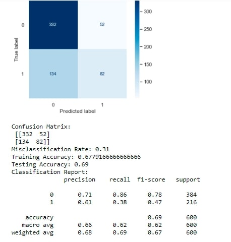

# TQ_1
Take Home Quiz for Machine Learning 4364 with Prof. Hamidian

## Take Home Quiz 1

**TQ.A**

**You can find that on the slides. Please elaborate on the Covid test results in a paragraph.**

To begin, sensitivity is the ability of an algorithm to identify true positives, or in this case, correctly identify COVID in a patient. Specificity, on the other hand, is the ability of a test to identify a true negative, or correctly identify COVID-free patients. The CDC's explanation in the article makes sense because a model that is highly sensitive will yield a higher positive predictive value when tested on a population where COVID is prevalent. In other words, the model does better in the environment it was designed for, which is a target population where COVID is significantly present. A population not fitting to this will lower the predictive power of the model. This is why the model does better in a population with 52% prevalence of antibodies vs. 5%.

**TQ.B**

**What is the classification problem you addressing?**

**What metrics are you using to evaluate your model, and Why?**

**Show your results and evaluation (Recall, FScore, Accuracy)**

**Please submit your notebook to GitHub and share the link to the repo. Please make sure that I have granted access to view your repo (sardarr@gmail.com)**

The classification problem I've chosen to address is one from my Statistical Data Mining class from last semester. For the midterm, we were given synthetic binary classification data (train-data4.txt) and had to build several classifiers (Logistic Regression, Decision Tree, Random Forest, Boosted tree).

The metrics I used to evaluate my model included the Misclassification Rate, Accuracy, Precision, Recall, and F1-Score. I used these metrics because the misclassification rate tells how often a model makes a FP or FN (false positive or false negative) classification, the accuracy tells us how often the model makes a correct prediction overall, the precision speaks to the sensitivity of the model, the recall the specificity of the model, and the f1_score is an overall score of how a model does, balancing the precision and recall in a weighted average. 

Below are the results of one of my logisitic regression models that had been hyperparameter-tuned via GridSearchCV. I also generated the confusion matrix with plot_confusion_matrix and confusion_matrix:

